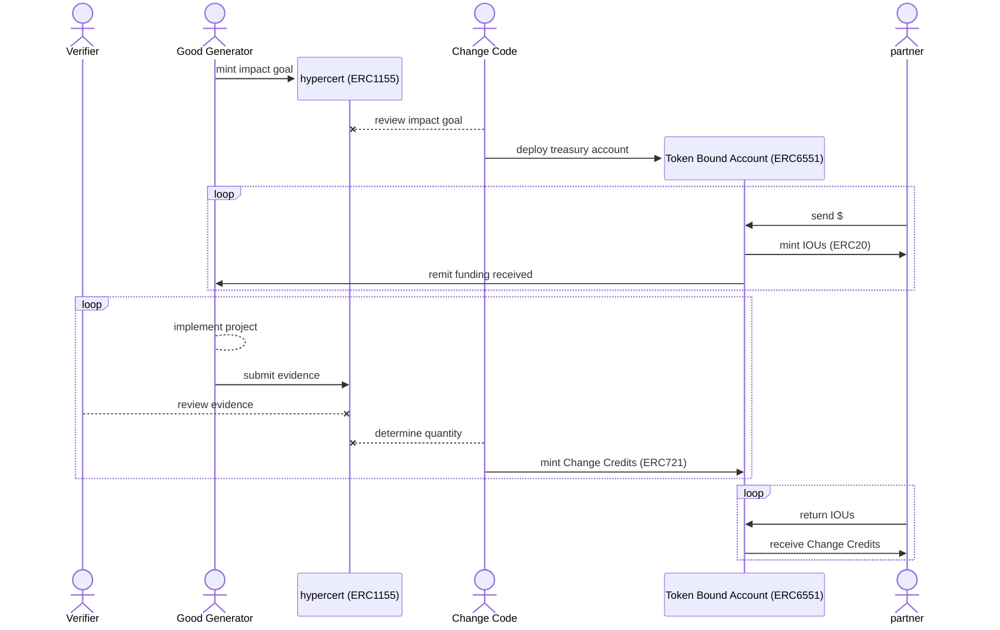

# Background & Minting

Change Credits are a novel *financial* primitive supporting resource allocation, verification, and tracking of positive externalities (social and environmental impact).

They are the basis and grounding of Change Code's economic engine, providing a real-world tangible link to underpin a new form of beneficial currency.

## Foundation

Before expanding on the architecture and processes involved in Change Credits directly, we should first recap (or introduce) some of the existing open-source tools and standards leveraged here.

### Hypercerts

Hypercerts are on-chain, tokenized claims of positive impact. To be more precise, hypercerts represent *claims* of *work* done toward some beneficial outcome, be that work toward social or environmental impact or the building of a public good.

A complete list of the on-chain token data and off-chain metadata included in a hypercert can be found in the [documentation](https://hypercerts.org/docs/implementation/metadata). Importantly for our purposes and designs, there is no included support for verification that the work was completed or efficacious. This will therefore be addressed using another foundation public good, the Ethereum Attestation Service (EAS). However, the hypercerts specification does include a field for a list of contributors. Change Credits takes advantage of this encoding to record contributions of the actual work being done, while tracking *financial partners* through ownership of Change Credits themselves.

### Ethereum Attestation Service (EAS)

Change Code leverages the EAS to allow experts and representatives of affected communities to verify (attest to) any work done that is claimed to be impactful or contribute to a public good.

While not tokens themselves (more on that [here](https://docs.attest.org/docs/core--concepts/attestations-vs-x)), these attestations are cryptographically secured and can be used by project partners and the public to confirm all verifications of a project's work.

### Token Standards

To maintain maximum compatibility across existing wallets and infrastructure, the Change Credits architecture leverages only broadly accepted ERC token standards. Change Credits themselves are minted as NFTs (non-fungible tokens) through the ERC721 standard.

+++ ERC721
ERC721 is the most widely adopted token standard for NFTs. The standard is well tested, and enjoys near universal support across wallet implementations.
+++ ERC1155
Hypercerts adhere to the ERC1155 standard for semi-fungible tokens. This mixed standard, existing in the divide between fungible and non-fungible tokens, offers ideal flexibility for the unique requirements of the hypercerts standard.
+++ ERC20
ERC20 tokens are fully fungible and well suited for liquidity and open exchange. IOUs issued in anticipation of Change Credits themselves are minted as ERC20 tokens to support the emergence of free exchange by holders who may wish to access liquidity.
+++ ERC6551
Referred to as "token bound accounts" (TBAs), ERC6551 tokens function as a form of smart contract wallet where an account is simultaneously able hold or mint tokens itself and be considered a token (an NFT more specifically) in its own right. Change Code leverages TBAs to serve as *treasury accounts* for the receipt of funds into projects and the minting of Change Credits.
+++

## Change Credit Minting

Because Change Credits are only minted following confirmation of realized, tangible, and verifiable impact, there the process by which these assets are created follows a number of steps and involves multiple types of actors.

