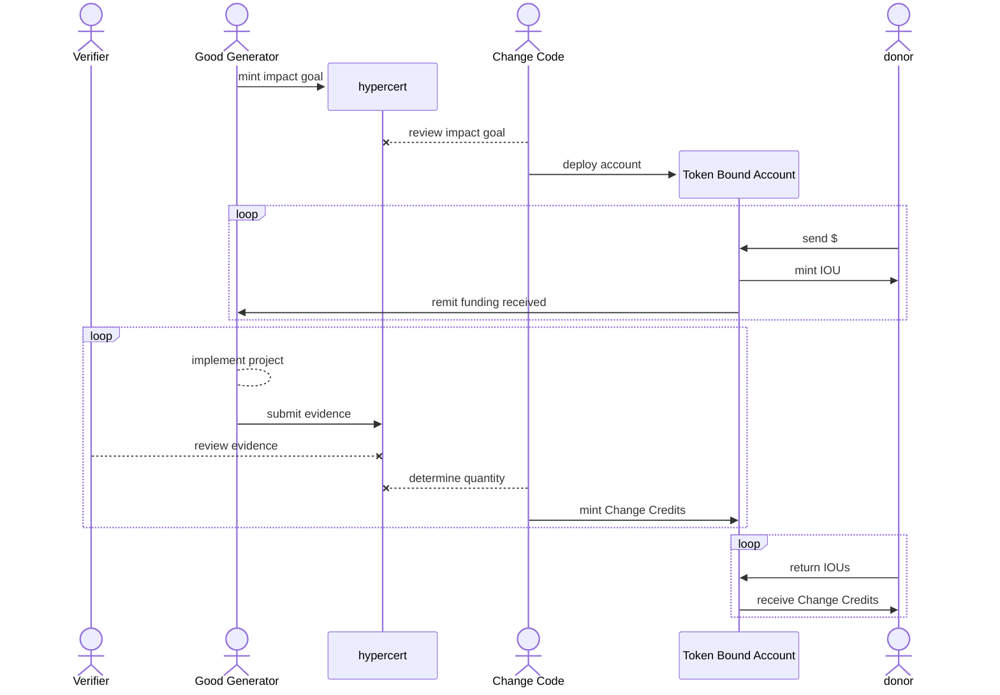

# Change Credits

Change Credits are a novel *financial* primitive supporting resource allocation, verification, and tracking of positive externalities (social and environmental impact).

They are the basis and grounding of Change Code's economic engine, providing a real-world tangible link to underpin a new form of beneficial currency.

## Foundation

Before expanding on the architecture and processes involved in Change Credits directly, we should first recap (or introduce) some of the existing open-source tools and standards leveraged here.

### Hypercerts

*Token Standards*
+++ ERC1155
This is Tab 1
+++ ERC20
This is another Tab
+++ ERC6551
+++

