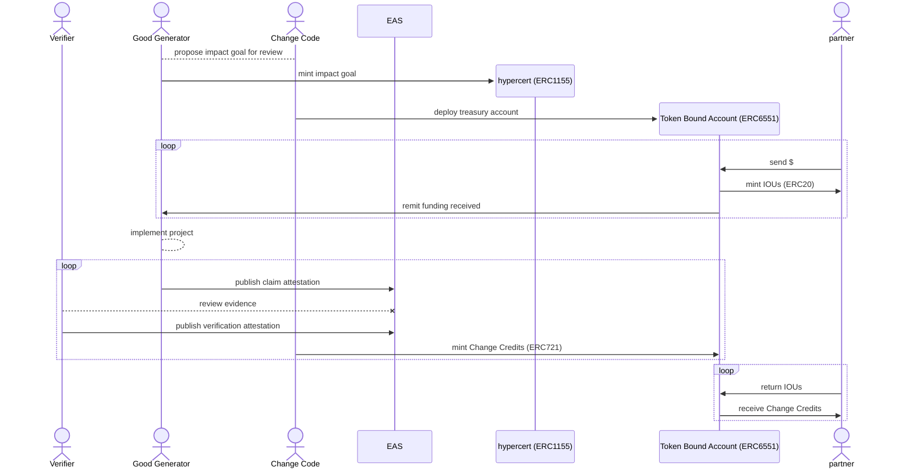

Because Change Credits are only minted following confirmation of realized, tangible, and verifiable impact, the process by which these assets are created follows a number of steps and involves multiple types of actors.

## Participants

Good Generator
:   A Good Generator is the implementing organization responsible for seeing the planned impact results achieved. It is through the actions of this entity, often an NGO or social enterprise, that positive externalities are produced. Because contributions and funds can be seamlessly fractionalized and divided, a Good Generator can also be a collection of multiple contributors working collaboratively.

Change Code
:   Change Code acts to provide all necessary infrastructure for the creation and management of Change Credits through its *Changescape*. While Change Code is not involved in the measurement or verification of any results produced, it is responsible for assessing the legitimacy and compliance of any organizations seeking to mint Change Credits.

Partner
:   Partners financially contribute to the positive externalities embodied in Change Credits. They fund the delivery of impact by pre-purchasing Change Credits in advance.

Verifier
:   Verifiers exist to both validate, measure, and quantify any impact produced. Verifiers are defined by the Good Generator of the project with a focus on local context and relevant expertise. Verification can be conducted by a single individual or organization or the responsibility can be dispersed through a set of Verifiers with a specified quorum required.

## Minting Flow

The above sequence diagram overviews how Change Credits are created. While the system supports alternative flows to facilitate various forms of financing, we can consider this base form to have x steps.

1. The Good Generator submits an impact goal and plan for review by Change Code, as part of their onboarding process. Once approved to mint via the Changescape, the Good Generator mints their hypercert, signaling the beginning for their project.
2. After the projects' hypercert has been deployed, Change Code deploys an associated Token Bound Account (TBA) to act as a treasury for the project to receive funds into and mint tokens from.
3. Partners begin contributing funds into the project's TBA in exchange for IOUs redeemable for Change Credits once the latter begin to be minted. These funds are then remitted to an account from which the Good Generator can spend to cover the costs of their work. This process can be done in an open-ended asynchronous manner, with funds being contributed to the project through the project's lifespan.
4. As the Good Generator carries out their work to produce impact, they periodically submit evidence for review. This evidence is published via the Ethereum Attestation Service (EAS). These claims are then reviewed and approved or rejected by Verifiers.
5. Once evidence is confirmed by Verifiers, Change Code intakes the data provided to assign a quantity of Change Credits to be created and mints them via the project's TBA.
6. With Change Credits minted and available via the TBA, the project's Partners can redeem their IOUs and receive their proportional share of Change Credits.

## Change Credit Ownership

As detailed [here], a key utility of Change 