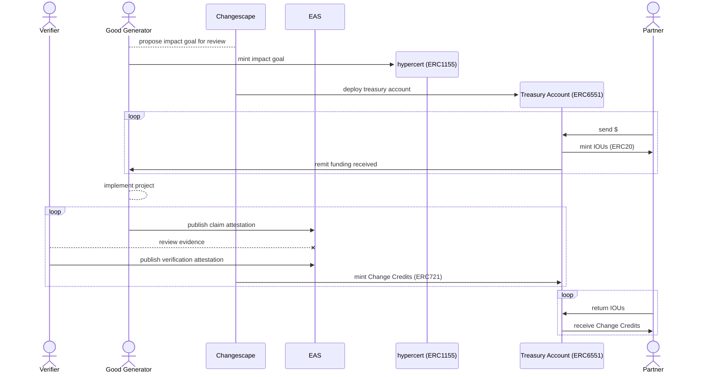

Because Change Credits are only minted following confirmation of realized, tangible, and verifiable impact, the process by which these assets are created follows several steps and involves multiple types of actors.

## Participants

Good Generator
:   A Good Generator is the implementing organization responsible for achieving the planned impact results. It is through the actions of this entity, often an NGO or social enterprise, that positive externalities are produced. Because contributions and funds can be seamlessly fractionalized and divided, a Good Generator can also be a collection of multiple parties working collaboratively.

Changescape
:   Change Code provides all necessary infrastructure for creating and managing Change Credits through its *Changescape*. While the Changescape does not itself measure or verify any of the results produced, Change Code as the administrator of the Changescape is responsible for assessing the legitimacy and compliance of any organizations seeking to mint Change Credits.

Partner
:   Partners financially contribute to the positive externalities embodied in Change Credits. They fund the delivery of impact by pre-purchasing Change Credits in advance.

Verifier
:   Verifiers exist to validate, measure, and quantify any impact produced. The Good Generator of the project defines Verifiers, typically opting for parties who possess local context and relevant expertise. Verification can be conducted by a single individual, an organization, or a set of Verifiers with a specified quorum requirement.

## Minting Flow

The above sequence diagram overviews how Change Credits are created. While the system supports alternative flows to facilitate various forms of financing, we can consider this base form to have x steps.

1. The Good Generator submits an impact goal and plan for measurement (monitoring & evaluation) as part of their onboarding process. Once approved to mint via the Changescape, the Good Generator mints their hypercert, signaling the beginning of their project. It's important to note that Good Generator can conduct any number of projects. 
2. After the project's hypercert has been deployed, Change Code deploys an associated Token Bound Account, or TBA, (ERC6551) to act as a treasury for the project (the primary treasury activities being minting Change Credits and receiving funds from partners purchasing impact). 
3. Partners begin contributing funds into the project's TBA in exchange for IOUs redeemable for Change Credits once the latter are actually minted. These funds are then remitted to an account from which the Good Generator can spend the resources raised to cover the costs of their work. This process can be done in an open-ended asynchronous manner, with funds being contributed to the project throughout its lifespan.
4. As the Good Generator carries out work to produce impact, they periodically submit evidence for review. This evidence is published via the Ethereum Attestation Service (EAS). Verifiers then review and approve or reject submitted evidence.
5. Once Verifiers confirm evidence, the Changescape 1) intakes the data provided to assign a quantity of requisite Change Credits, and 2) mints the Change Credits via the project's TBA.
6. With Change Credits minted and available via the TBA, the Good Generator's Partners can redeem their IOUs and receive their proportional share of Change Credits.

## Change Credit Ownership

Beyond forming the economic basis for [Mutual Money](../mutual-money/currency-minting.md), Change Credits create a special relationship between Partners and the projects they back. As demonstrated in the [schema](../data-schemas/change-credits-spec.md) for Change Credits, contributions to projects are represented by NFTs, meaning that each contribution, regardless of size, still creates a single token. The reasoning behind this decision is, at least in part, a statement of values from Change Code that all contributions matter and should be recognized.

When it comes to the rights conferred to Change Credit holders (Partners), each project's Good Generator is required to specify. They can choose to select and calibrate any (or all) of the following.

##### Voting Power
Good Generators can use Change Credits to include their Partners in decision-making processes. These can be small or large decisions, implemented on a one-time or ongoing basis. Additionally, Good Generators can select how to allocate voting power. Each NFT holder can be given a single vote or the `Balance` can be used so that Partners representing larger economic interests are allocated larger influence.

##### Exclusive Access
It is not uncommon for organizations producing positive externalities to host events, whether social, cultural, or academic, where attendance is in high demand. Change Credits can be used to grant access to these events.

##### Credit Retirement
Certain Good Generators may be social enterprises, capable of producing both profit and positive externalities, or they may be engaged in various forms of blended finance. In either case, there will be Good Generators who may be both capable of and interested in offering an economic incentive to further entice Partners to support their positive work. One way to realize this alignment is through Change Credit [retirement](./cc-retirement.md).
