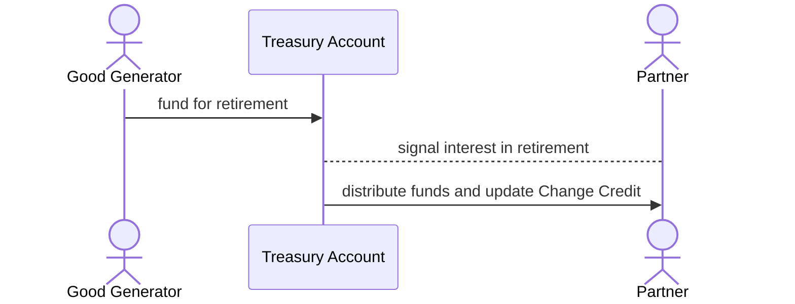

When a Good Generator is able concurrently generate positive impact and traditional revenue, an opportunity emerges to further align interests between themselves and their Partners. These social enterprises may leverage Change Credits to jump start their work in producing green energy, developing affordable housing, lowering the cost of healthcare or education, or achieving almost any other means of positive change that can also produce revenue.

A more traditional model for these social enterprises would be to offer equity or debt from their organizations where the positive impact is seen and structured as merely an ancillary benefit. The shortcoming in such a model is that there is no economic value ascribed to the impact externality itself, but the cost is still present. Imagine a company that made tables and chairs but could only sell its tables, while being expected to produce and distribute its chairs without payment. Would this company be able to effectively compete for capital against a business that produced and sold only tables without the deadweight of chair production.

The Changescape is different. Inside the Changescape, positive externalities are seen as economic goods unto themselves. In support of this paradigm shift, instead of selling equity or debt with *blended returns*, social enterprises can instead commit funds to repurchase and retire their Change Credits.

## Retirement Flow

The above sequence diagram offers an overview of the steps of Change Credit retirement, which is described in greater detail across 6 steps.

1. Before any of the above interactions take place, the Good Generator may optionally specify a target or even guaranteed amount of funds that will be used to repurchase and retire its Change Credits. This target can be published as part of deploying the project inside the Changescape or may simply be disseminated through the organizations usual channels communication.
2. Once funds are available (and after Change Credits have already begun to be distributed), the Good Generator would remit funds into the project's Treasury Account.
3. With funds available in the account, the Good Generator must specify how retirement will occur--declaring the price they are willing to pay for each Change Credit received and optionally setting a maximum fraction of each Change Credit that may be retired.
4. Partners holding Change Credits may now signal themselves as interested in retirement, optionally setting their own maximum retirement portion.
5. As Partners signal interest in retirement, the Treasury Account automatically distributes funds and updates the `Balance` and `Retirement` values of participating Change Credits accordingly.