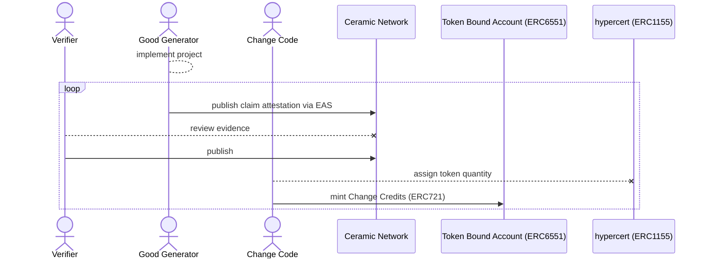

Change Credits form the basis and backing of Mutual Money. As such, the verification of all impact claims is critical to ensuring that not only is the currency fully *backed* but also

```mermaid
sequenceDiagram
    actor Verifier
    actor Good Generator
    actor Change Code
    participant Ceramic Network
    participant Token Bound Account (ERC6551)
    Good Generator-->Good Generator: implement project
    loop
        Good Generator->>Ceramic Network: publish claim attestation via EAS
        Verifier--xCeramic Network: review evidence
        Verifier->>Ceramic Network: publish 
        Change Code--xhypercert (ERC1155): assign token quantity
        Change Code->>Token Bound Account (ERC6551): mint Change Credits (ERC721)
    end
```