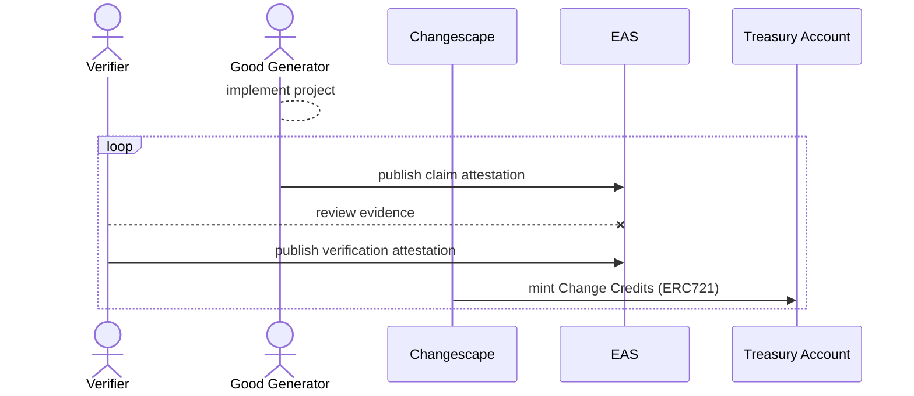

The Changescape is designed as an *impact maximizing* protocol, meaning that every design decision is intended to drive capital and interest toward projects producing positive externalities most efficiently and effectively. Instead of focusing on social validation or popularity, the Changescape centers the concept of verification in the protocol so that primary impact representation in the system, Change Credits, are only ever minted from verified impact, rather than from mere claims of impact.

## Ethereum Attestation Service

In order to accomplish this verification and ensure maximum interoperability with the broader space, Change Code leverages the Ethereum Attestation Service (EAS).

EAS relies on `schemas` to structure the data provided as `attestations` that can be viewed either publicly or with specified permissions. As can be seen [here](../data-schemas/attestations.md), Change Code has two separate schemas defined. The first schema, the claim schema, is used by Good Generators to publish their claim attestations, the evidence they provide to substantiate their work and the impact produced. The second schema is used by Verifiers, after having reviewed the claims attestations, to denote either their acceptance or rejection of the claims made and to provide their quantification of the amount of impact produced.

## Verification Flow

As shown in the above sequence diagram, the process of verification can (and often will) be carried out as a loop. As a project is implemented over a period of weeks, months, or even years, the Good Generator may periodically submit claim attestations on recent accomplishments and evidence. As soon as these claims are available (or at some pre-arranged cadence), Verifiers may review this data and submit their own attestations. Finally, with these review attestations published, the Changescape programmatically mints Change Credits in accordance with the impact quantity specified by the Verifiers.

By allowing for interim data reporting, the protocol enables Verifiers to have access to data in a more timely manner, which in practice enables more robust dispute or follow up. Additionally, with this setup, Change Credits are available to Partners sooner than if all reporting were unnecessarily forced to only occur at the end of a project's timeline.

## Verifiers

Verifiers are experts impact measurement and evaluation selected to review data provided by Good Generators and assess the veracity and quantity of impact generated. When a project is instantiated, Verifers are specified along with an approval quorum. For example, a project may have listed 3 potential verifiers with any 2 being required to approve the project's claims for Change Credits to be issue.

When it comes to the quantity of Change Credits to be issued, this number is obtained by a simple average of the all quantities reported by each approving Verifier.

In the initial iteration of the Changescape, Verifiers are proposed by a project's Good Generator and approved by Change Code based on their expertise while confirming they are free from any conflicts of interest. In future versions of the protocol, this process is set to be upgraded to have Verifiers organized as a collective (or DAO) with the ability to control its own membership.