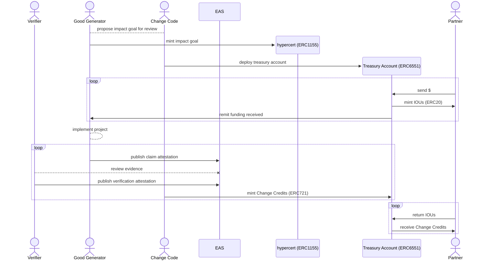

The lifecycle of a Change Credit can *end* in 3 different ways. First, a holder could continue to hold (or circulate) the token in perpetuity, allowing each holder to exercise whatever [rights](../change-credits/cc-minting/#change-credit-ownership) may be imprinted in the token by the Good Generator who created it. Second, the Change Credit may be [purchased and retired](../change-credits/cc-retirement.md), either completely or partially, by the issuing Good Generator. Finally, the Change Credit can be monetized.

While the process of retirement enables Good Generators to buy up and retire (burn) the credits they've issued, the process of monetization encompasses the entire Changescape. When monetized, Change Credits become the basis for a unique value-aligned currency, __Mutual Money__.

## Monetization

Fiat money is created through a process known as [debt monetization](https://www.stlouisfed.org/on-the-economy/2018/april/debt-monetization-then-now), through which a central bank purchases state debt and then issues currency *against* the value of that debt. This introduces a constant source of demand for the state's debt thereby reducing borrowing costs and effectively subsidizing spending. The seigniorage produced through monetization is a powerful means of collective support by users of a currency toward the state issuing the underlying debt.

This idea of monetization and seigniorage can be reimagined for nearly any set of community values, where adoption of the currency mechanistically supports the realization and furtherance of the community's value system. With this in mind, we propose that Change Credits, and the positive externalities they represent, can be monetized through Mutual Money.

## Participants

Change Credit Holder
:   A Good Generator is the implementing organization responsible for seeing the planned impact results achieved. It is through the actions of this entity, often an NGO or social enterprise, that positive externalities are produced. Because contributions and funds can be seamlessly fractionalized and divided, a Good Generator can also be a collection of multiple contributors working collaboratively.

Mutual Mint
:   Change Code acts to provide all necessary infrastructure for the creation and management of Change Credits through its *Changescape*. While Change Code is not involved in the measurement or verification of any results produced, it is responsible for assessing the legitimacy and compliance of any organizations seeking to mint Change Credits.

Seigniorage Bank
:   Partners financially contribute to the positive externalities embodied in Change Credits. They fund the delivery of impact by pre-purchasing Change Credits in advance.

Verifier
:   Verifiers exist to both validate, measure, and quantify any impact produced. Verifiers are defined by the Good Generator of the project with a focus on local context and relevant expertise. Verification can be conducted by a single individual or organization or the responsibility can be dispersed through a set of Verifiers with a specified quorum required.

## Minting Flow

